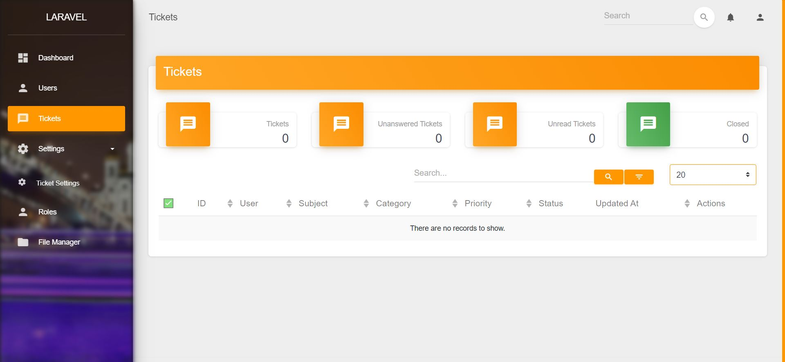
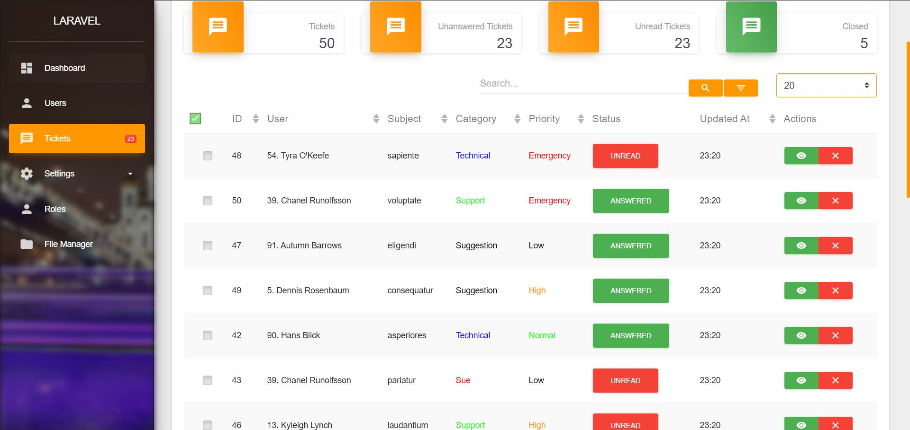
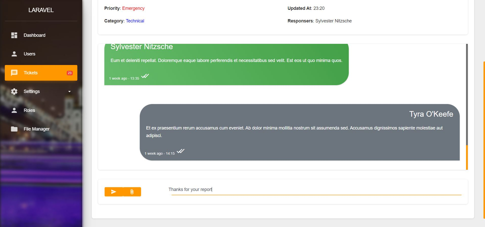
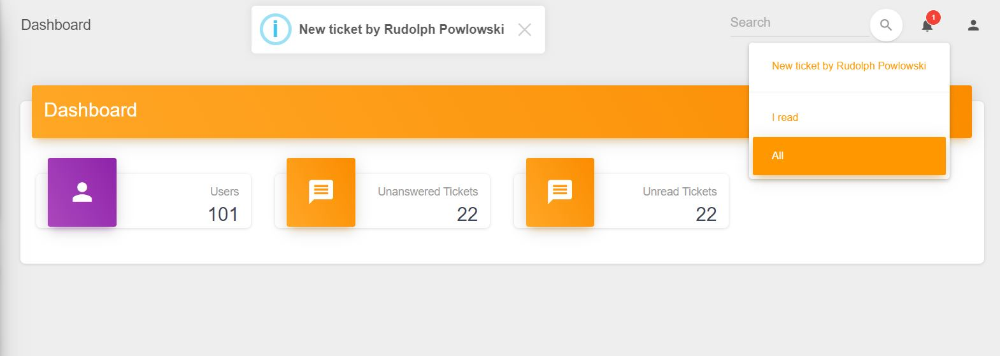

# Support ticketing for [Sanjab](https://github.com/sanjabteam/sanjab)

- [Installation](#installation)
- [Getting started](#getting-started)
- [Configuration](#configuration)
- [Notification](#notification)
- [Client-side](#client-side)
- [License](#license)

## Installation

First, you should prepare Sanjab for custom compile.

[Custom Compile Sanjab](https://sanjabteam.github.io/compile.html)

Install the composer package.

```bash
composer require sanjabteam/ticket
```

Install the npm package.
```bash
npm i sanjab-ticket --save-dev
```

Submit `sanjab-ticket` plugin for sanjab Vue instance in `sanjab.js`:

```js
require('sanjab');

Vue.use(require('sanjab-ticket').default); // Add this line

if (document.querySelector('#sanjab_app')) {
    window.sanjabApp = new Vue({
        el: '#sanjab_app',
    });
}
```

Compile javascript:

```bash
npm run watch
```

Publish config file:

```bash
php artisan vendor:publish --provider="SanjabTicket\SanjabTicketServiceProvider" --tag=config
```

Add ticket controllers to `controllers` in `config/sanjab.php`:

```php
'controllers' => [
    ...
    SanjabTicket\Controllers\TicketController::class,
    SanjabTicket\Controllers\TicketSettingController::class,
],
```

and add provider to plugins/providers in `config/sanjab.php`:

```php
'plugins' => [
    /*
    |--------------------------------------------------------------------------
    | Plugin's service providers that should be booted before sanjab service provider.
    |--------------------------------------------------------------------------
    */
    'providers' => [
        \SanjabTicket\SanjabTicketServiceProvider::class // Add this
    ],
],
```

Migrate database:

```bash
php artisan migrate
```

Go to the admin panel and `Tickets` and `Ticket Settings` should be in the sidebar.


## Getting started

Provide some ticket category/priority.

> Make sure you wrote seeder for users before this seeder and make sure you have more than 1 user.

```bash
php artisan make:seeder TicketSeeder
```

Open TicketSeeder and provide some data.

```php
<?php

namespace Database\Seeders;

use App\Models\Ticket;
use App\Models\TicketCategory;
use Illuminate\Database\Seeder;
use SanjabTicket\Models\TicketPriority;

class TicketSeeder extends Seeder
{
    /**
     * Run the database seeds.
     *
     * @return void
     */
    public function run()
    {
        TicketPriority::create(['name' => 'Low', 'color' => '#000000']);
        TicketPriority::create(['name' => 'Normal', 'color' => '#00ff00']);
        TicketPriority::create(['name' => 'High', 'color' => '#ff9800']);
        TicketPriority::create(['name' => 'Emergency', 'color' => '#ff0000']);

        TicketCategory::create(['name' => 'Support', 'color' => '#00ff00']);
        TicketCategory::create(['name' => 'Technical', 'color' => '#0000ff']);
        TicketCategory::create(['name' => 'Suggestion', 'color' => '#000000']);
        TicketCategory::create(['name' => 'Criticism', 'color' => '#ff9800']);
        TicketCategory::create(['name' => 'Sue', 'color' => '#ff0000']);

        Ticket::factory(50)->create();
    }
}
```

And seed:

```bash
php artisan db:seed --class=TicketsTableSeeder
```




## Configuration

* database
    * model: The user model class.
    * format: Format of showing user name. (Example: `"%first_name %last_name"`)
    * fields: Extra user model fileds that should be shown in ticket messages page. (Example: `["email" => "E-Mail", "mobile" => "Mobile", "address" => "Address"]`)
* files
    * disk: Disk to save ticket files.
    * directory: Directory in the disk. You can use {TICKET_ID} to make directory per ticket. (Example: `tickets/{TICKET_ID}`)
* notifications
    * new_ticket: When new ticket message submitted.
        * admin: Notification class for all admins that has access to the tickets section
        * client: Notification class for the client that submitted ticket when got an answer.

## Notification

First, make sure you created the Notifications table.

```bash
php artisan notification:table
php artisan migrate
```

and also make sure you used `Illuminate\Notifications\Notifiable` trait in your user model class.

```php
use Illuminate\Notifications\Notifiable;

class User extends Authenticatable
{
    use Notifiable, SanjabUser;
        ^^^^^^^^^^
```

Then you should see a bell icon in the sanjab navbar at the top for notifications.

Create a notification class for admins.

```bash
php artisan make:notification NewTicket
```

For example, we only gonna use the database.
Of course, you can send an email and/or SMS and/or any other method.

```php
use SanjabTicket\Models\Ticket;

class NewTicket extends Notification
{
    use Queueable;

    /**
     * Ticket
     *
     * @var Ticket
     */
    protected $ticket;

    /**
     * Create a new notification instance.
     *
     * @return void
     */
    public function __construct(Ticket $ticket)
    {
        $this->ticket = $ticket;
    }

    /**
     * Get the notification's delivery channels.
     *
     * @param  mixed  $notifiable
     * @return array
     */
    public function via($notifiable)
    {
        return ['database'];
    }

    /**
     * Get the array representation of the notification.
     *
     * @param  mixed  $notifiable
     * @return array
     */
    public function toArray($notifiable)
    {
        return [
            'text' => 'New ticket by '.$this->ticket->user->name,
            'url' => route('sanjab.modules.tickets.show', ['id' => $this->ticket->id]), // Url to chat page
            'toast' => true, // Show a toast alert on top
            'sound' => true, // Play notification sound
        ];
    }
}
```

And then submit notification class in `config/sanjab-ticket.php`:

```php
'notifications' => [
        // ...
        'new_ticket' => [
            //...
            'admin' => \App\Notifications\NewTicket::class,
        ]
]
```

And now make a new ticket.

```bash
php artisan tinker
Psy Shell v0.9.12 (PHP 7.2.12 — cli) by Justin Hileman
>>> \SanjabTicket\Models\Ticket::factory()->create()
```



## Client-side
It's all up to you.
You only need to work with these model classes.

* [SanjabTicket\Models\Ticket](./src/Models/Ticket.php)
* [SanjabTicket\Models\TicketMessage](./src/Models/TicketMessage.php)
* [SanjabTicket\Models\TicketCategory](./src/Models/TicketCategory.php)
* [SanjabTicket\Models\TicketPriority](./src/Models/TicketPriority.php)


## License

The MIT License (MIT). Please see [License File](LICENSE.md) for more information.
